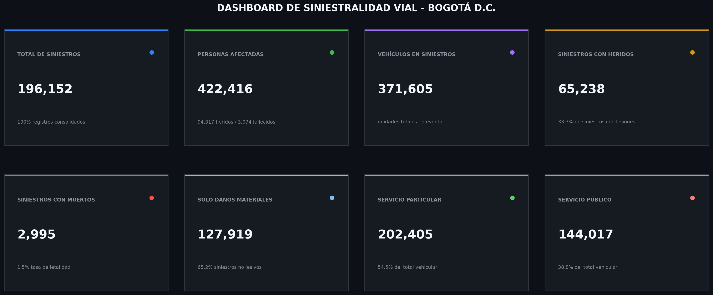

# Dataset Vial Bogotá — Análisis de Siniestros Viales

Programa en Python que procesa el histórico de siniestros viales en Bogotá (2015-2020).
Genera automáticamente un reporte con gráficos y conclusiones en lenguaje natural
sobre patrones temporales, causas, vehículos y personas involucradas.

## Instalación

```bash
pip install -r requirements.txt                                 # Linux
pip install pandas numpy matplotlib seaborn openpyxl            # Windows
```

## Uso

```bash
python3 main.py siniestros_viales_consolidados_bogota_dc.xlsx   # Linux
py main.py siniestros_viales_consolidados_bogota_dc.xlsx        # Windows
```

El data set utilizado es un `.xlsx` con las hojas `SINIESTROS`, `ACTOR_VIAL`,
`VEHICULOS`, `HIPOTESIS` y `DICCIONARIO`. Si falta alguna hoja o columna esperada, el script se detiene con un mensaje explicando exactamente qué falta.

## Salida

Al terminar de ejecutarse el programa generará la carpeta `reporte_siniestros/` que contendrá gráficos estadísticos:

- `tendencia_anual.png`
- `patron_horario.png`
- `patron_dia_semana.png`
- `top_localidades.png`
- `top_causas.png`
- `top_vehiculos.png`
- `actores_afectados.png`
- `distribucion_edad.png`
- `conclusiones.txt` — un pequeño resumen de los hallazgos automáticos.

## Capturas



## Fuente de datos

Los datos corresponden al histórico de siniestros viales en Bogotá, disponibles públicamente en:
[Datos Abiertos Bogotá](https://datosabiertos.bogota.gov.co/).